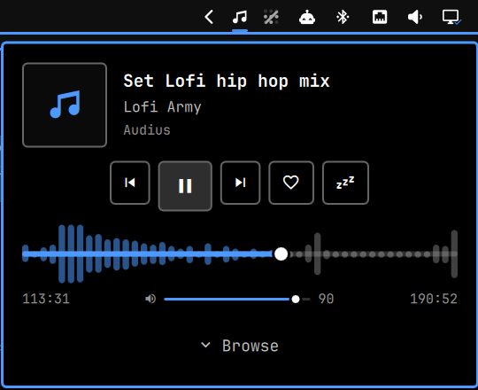
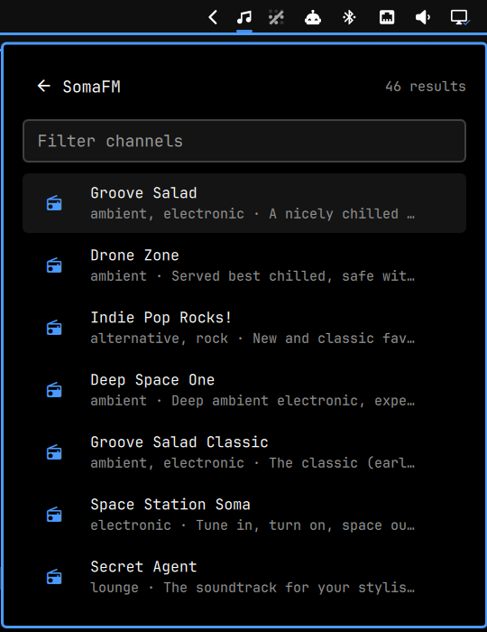
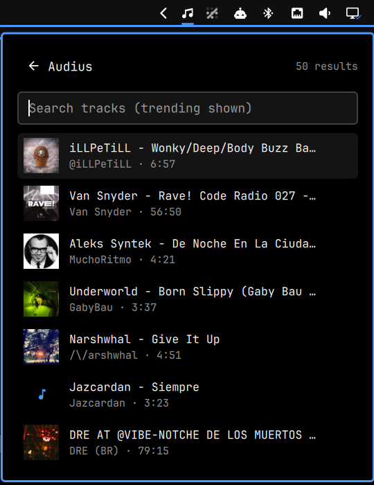

# shojey

A tiny music player plugin for the Omarchy shell.

Pick something from the bar, it plays through `mpv` in the background. Because
the system `mpv-mpris` script exposes mpv over MPRIS, Omarchy's media keys, OSD
and media widget control it like any other player.

<p>
  
  
  
</p>

## Sources

| Source | What | Key needed |
|---|---|---|
| [SomaFM](https://somafm.com) | ~45 curated, ad-free radio channels | no |
| [Radio Paradise](https://radioparadise.com) | 7 ad-free channels, with cover art for the song on air | no |
| [Radio Browser](https://www.radio-browser.info) | ~50k community-listed internet radio stations; search by name, tag or country | no |
| [Audius](https://audius.co) | on-demand tracks: trending and search | no |
| [ccMixter](https://ccmixter.org) | Creative Commons tracks and remixes: editor's picks and search | no |

Audius and ccMixter results are queued as a playlist, so next / previous walk
through them. Source lists are cached for ten minutes, so reopening one is
instant, and the last copy is shown if a refresh fails.

## Bar widget

| Click | Action |
|---|---|
| left | open the now-playing card |
| right | play / pause |
| middle | stop |
| scroll | volume |

The card shows artwork, track and source, prev / play / next / favorite, a
sleep timer, a LIVE marker or track position, a volume slider, buttons for
each source, and your favorites and recent plays. Everything happens in the card: pick a source and its channels or
search results open in place. "All ›" opens the full favorites or recent list,
where ✕ (or Delete) removes an entry.

When nothing is playing the card offers to resume the last thing you played
(right-clicking the icon does the same). If a stream fails or drops for good,
the card says so and offers Retry; short network drops reconnect on their own.
The card only follows the mpv that shojey started, so a video playing in
another mpv doesn't take it over.

The volume is mpv's own, separate from the system volume, and is kept for the
next play. The sleep timer button steps through 15, 30 and 60 minutes and off;
playback stops when it runs out.

A track (anything that isn't a live station) gets a seek bar: drag it, click
anywhere on it, or scroll over it to move through the track. Click the elapsed
time, or press g, to type where to go: `3` jumps to minute 3, `3:20` to 3:20.

Every song a live station announces is logged under "Heard on air", so you can
look up what was playing earlier. Picking a song copies its title to the
clipboard.

Keys: space play/pause, ←/→ previous/next, ↑/↓ volume, , / . back / forward 10 seconds,
g go to a time, f favorite, t sleep timer, s/p/r/a/c open SomaFM/Paradise/Radio/Audius/ccMixter, o songs heard on
air, ↑/↓ and enter in a list, esc back.

Bind the card to a key with:

```
omarchy-shell shell summon boris.shojey
```

## CLI

```
bin/shojey menu                 source picker (default)
bin/shojey soma|paradise|radio|audius|trending|search|ccmixter|favorites
bin/shojey list <source> [query]  print a source's entries as JSON
bin/shojey play <url> [title]   play a stream or file
bin/shojey play-saved <url>     replay a recent or favorite entry
bin/shojey fav [url] [title]    toggle a favorite (default: what's playing)
bin/shojey forget <url>         remove an entry from recent plays or the song history
bin/shojey volume [N|+N|-N]     print or set the player volume, 0-100
bin/shojey seek <time>          jump within a track: M:SS, seconds, +N / -N, or N%
bin/shojey sleep [minutes|off]  stop playback after a while
bin/shojey resume|dismiss       play the last entry again / clear an error
bin/shojey toggle|stop|status   toggle resumes the last entry when stopped
```

State lives in `$XDG_RUNTIME_DIR/shojey/` (what's playing, the last error, the
sleep timer) and `$XDG_STATE_HOME/shojey/` (`recent.json`, `favorites.json`,
`history.json`, `volume`). Cached source lists are in `$XDG_CACHE_HOME/shojey/`.

`SHOJEY_MPV_ARGS` passes extra flags to mpv (e.g. `--ao=null` for silent tests).
`SHOJEY_CACHE_TTL` sets how many seconds a source list is cached (default 600;
0 turns the cache off).

## Requirements

`mpv`, `mpv-mpris`, `socat`, `jq`, `curl`, `wl-clipboard` — plus Omarchy's
`omarchy-menu-select` and `omarchy-menu-input`.

## Install

```
omarchy plugin add https://github.com/bshogol/shojey --enable
```

For development, symlink the checkout instead:

```
ln -sfn "$PWD" ~/.config/omarchy/plugins/boris.shojey
omarchy-shell shell rescanPlugins
omarchy plugin enable boris.shojey --section right
```

## Uninstall

```
omarchy plugin remove boris.shojey
```

Stop playback first (middle-click the bar icon): mpv runs on its own and keeps
playing after the plugin is gone. shojey writes nothing outside its own
directories; to clear your favorites, history and cached lists as well:

```
rm -rf "${XDG_STATE_HOME:-$HOME/.local/state}/shojey" "${XDG_CACHE_HOME:-$HOME/.cache}/shojey"
```
